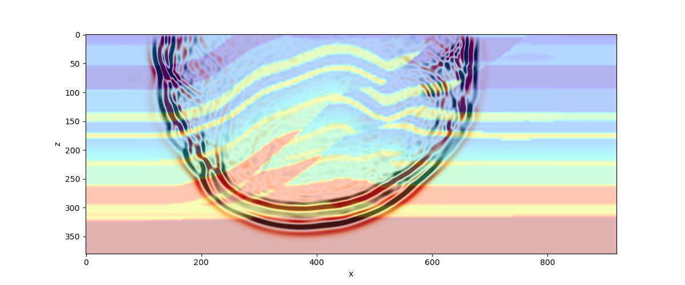
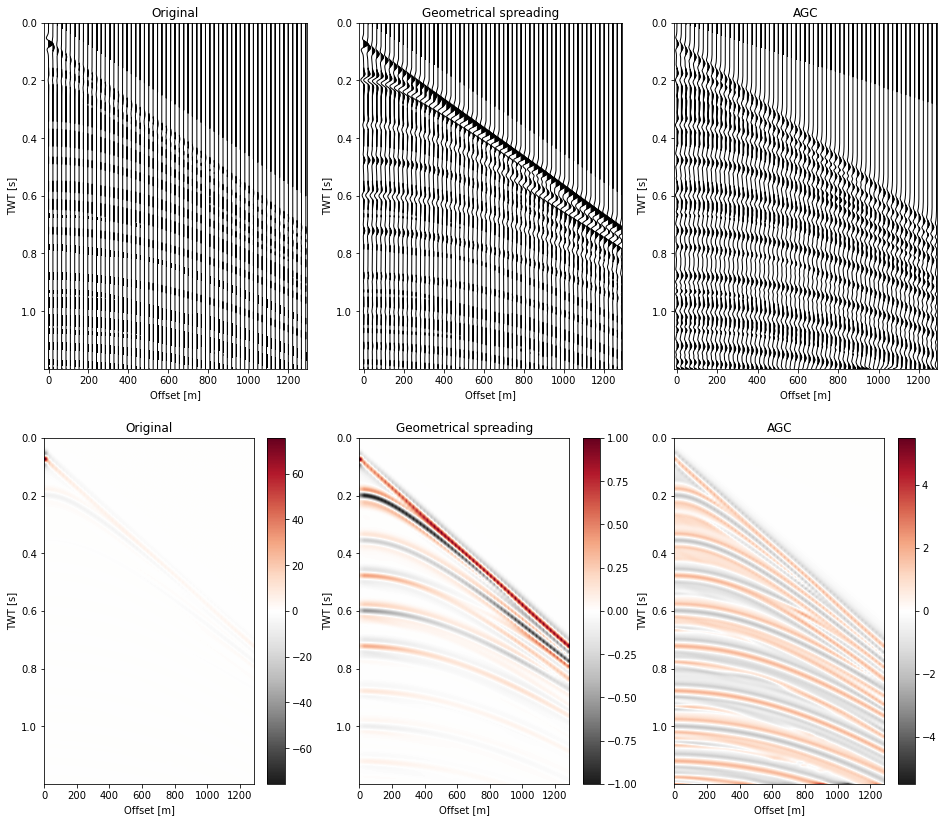

# Summary
`PestoSeis` is a Python package aiming at educational seismology. It contains tools to solve two-dimensional seismic problems in terms of traveltimes, rays, acoustic and elastic wave propagation and related plotting functions. Moreover, a set of functions performing basic seismic processing for exploration geophysics is provided. The entire package is written in the Python language to allow users to explore the code for understanding the numerical algorithms and to minimize dependencies and simplify the installation process. A set of illustrative examples covering all included algorithms is provided.

# Statement of Need

`PestoSeis` is a numerical laboratory to learn about seismology, written in the Python language. One of the design goals is simplicity and easiness of use. It contains a set of functions related to different aspects of seismology, ranging from simple straight ray computations to a full-waveform elastic solver for two-dimensional (2D) problems. It thus collects several routines under a single package allowing the user to explore different topics in seismology with a hands-on approach. Moreover, a complete set of examples demonstrating the functionality of the code is provided, with the double aim of illustrating some seismological problems and how to utilize the software.

The entire package is written in Python to avoid the need of linking to external libraries written in a compiled language and to allow the user to directly explore the code in order to understand how the algorithms work. Moreover, the depency on other packages is kept to the minimum to simplify the installation process and, again, understanding of the source code from the user perspective.
`PestoSeis` can thus be used, for instance, in a course on seismology, where a set of exercises can be designed to help understanding certain topics in a practical way, allowing the students to calculate results that could not be obtained by hand calculations.

`PestoSeis` addresses the following set of 2D seismic problems:
- computation of traveltimes for given source and receiver positions, provided a layered or grid-based velocity model, assuming straight rays;
- computation of traveltimes for given source and receiver positions, provided a grid-based velocity model, using a finite-difference method (fast marching);
- backtracing rays from the result of traveltime calculations in heterogeneous models;
- performing simple linearized ray tomography using a least squares approach;
- computing acoustic or elastic seismic wave propagation using a finite-difference method;
- performing some basic seismic processing for exploration seismology;
- plotting various input and output data related to the problems above.

This package allows anybody interested in playing around or gaining a more profound understanding of certain aspects of seismology to do that in a simple yet rigorous way. 

# Package Content

`PestoSeis` contains three main submodules:

1. traveltimes and rays (`ttimerays`);
2. seismic wave propagation (`seismicwaves2D`);
3. seismic processing (`reflectionseismo`).

Each one of these categories considers a specific use case and provides a variety of functions tailored to solve problems within the considered application. In the following, we give an overview of the functionalities of each submodule.

## Traveltimes and rays

`PestoSeis` provides functions to perform the following computations in heterogeneous media:

1. traveltimes given a velocity model by solving the eikonal equation [@sethianFastMarchingLevel1996; @rawlinsonWaveFrontEvolution2004]; 
2. trace "bent" rays;
3. straight rays;
4. in special case of a horizontally layered medium, use Snell's law to compute ray paths, traveltimes and the distance covered by the ray.
 
The functions provided in `pestoseis.ttimerays` allow the user to compute rays and traveltimes for a 2D velocity model, which is discretized on a rectilinear grid constructed from the user input. Figure \ref{ttimes_and_rays} shows an example from the field of medical imaging with computed traveltimes, bent ray paths and straight ray paths through a speed-of-sound model mimicking human breast tissue. The computed traveltimes can then be used to set up a tomographic problem, which may, for instance, be solved with a simple linear inversion under Gaussian assumptions (least squares approach) using a provided function. The available functions, in fact, allow the user to set up and solve simple 2D tomographic problems, thus they aim at providing a guide of how travel time tomography is performed in practice. 

## Seismic wave propagation

`PestoSeis` provides means to compute wave propagation in 2D for:

1. acoustic media solving the acoustic wave equation;
2. elastic media solving the elastic wave equation.

The acoustic and elastic wave equations in 2D are solved using finite differences on a staggered grid in both space and time in the `pestoseis.seismicwaves2D` submodule [@virieuxPSVWavePropagation1986; @komatitschUnsplitConvolutionalPerfectly2007]. Staggered grids generally allow for a better accuracy with only a small computational overhead. In order to compute wave propagation in either an acoustic or an elastic medium, the user needs to specify the parameters of the grid used to construct the velocity models, the source-receiver geometry and a source time function with dominant frequency. Furthermore, boundary conditions need to be set (`PestoSeis` provides implementation of reflecting boundary conditions, a Gauss taper (acoustic formulation only) or convolutionary perfectly matched layers [@komatitschUnsplitConvolutionalPerfectly2007]) with the option to specify a free surface at the top of the model. The function returns a seismogram recorded at the receivers as well as a set of snapshots of the wavefield. See figure \ref{acouwavefield}. Additionally, it is possible to collect the snapshots and save them to a `.mp4` movie file that illustrates the propagation of the seismic waves through the medium. The functions provided aim to equip the user with the possibility to quickly set up and visualize small scale 2D simulations.

## Seismic processing
 

`PestoSeis` provides code to set up and perform simple, small-scale seismic reflection experiments and to process the resulting data with common practice methods such as for instance arranging the data in shot gathers, generating a wiggle plot of the shot gathers, normal moveout correction, correcting for geometrical spreading or applying automatic gain control to a shot gather (see figure \ref{geomspragc}). Furthermore, some functionalities to process the data in the wavenumber-frequency domain are provided as well. All functions concerned with generating and processing seismic reflection data are part of the submodule `pestoseis.reflectionseismo`. Again, the main focus of the provided functions is to provide the user with some fast and simple tools to get familiar and experiment with common practice processing methods. 

## Tutorials

Finally, a number of tutorials that provide examples on how to use the functions within `PestoSeis` are provided in the form of Jupyter notebooks. These tutorials showcase different numerical scenarios and can be used to get started with `PestoSeis`.  

# References

