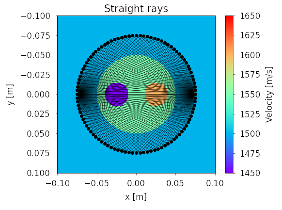
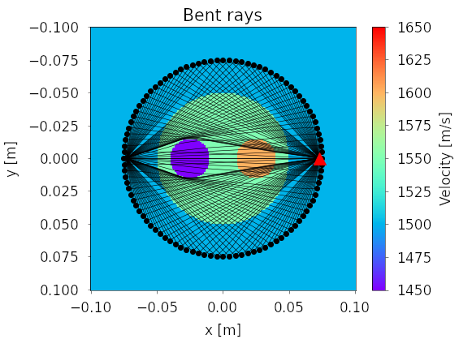
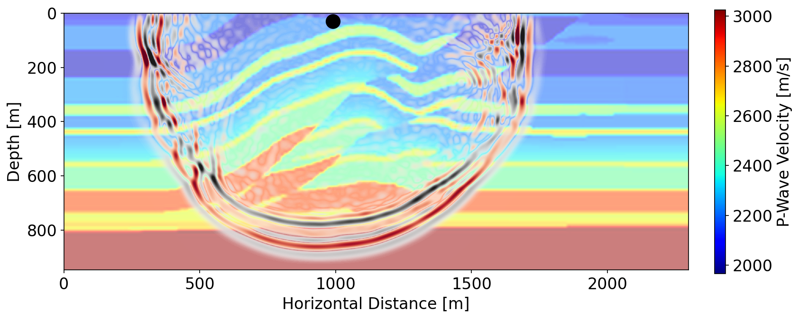

# PestoSeis

[](https://inverseproblem.github.io/PestoSeis/)

**PestoSeis** is a Python package which contains functions for performing simulations in wave physics, with a particular emphasis on seismic applications.  

Some of the of the functionalities within PestoSeis include:

- Straight-ray solver



- Bent-ray solver (eikonal equation)



- Linearized Ray Tomography

-  Acoustic and elastic wave propagation



- Basic exploration seismology processing functions

PestoSeis is primarily aimed at being a piece of educational software and has been written such as to enhance the readability of the code.  While perhaps not as performant as other codes used in seismology, the ease-of-use of PestoSeis make it very well suited for improving one's understanding of fundamental topics in seismology and wave physics.

## Quick Installation

To install PestoSeis, simply run the following command from the terminal:

```
pip install git+https://github.com/inverseproblem/PestoSeis
```

## Documentation
The documentation for PestoSeis can be found [here](https://inverseproblem.github.io/PestoSeis/).


