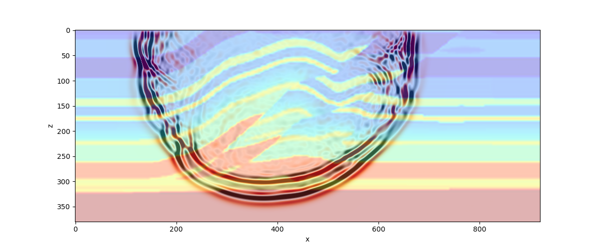
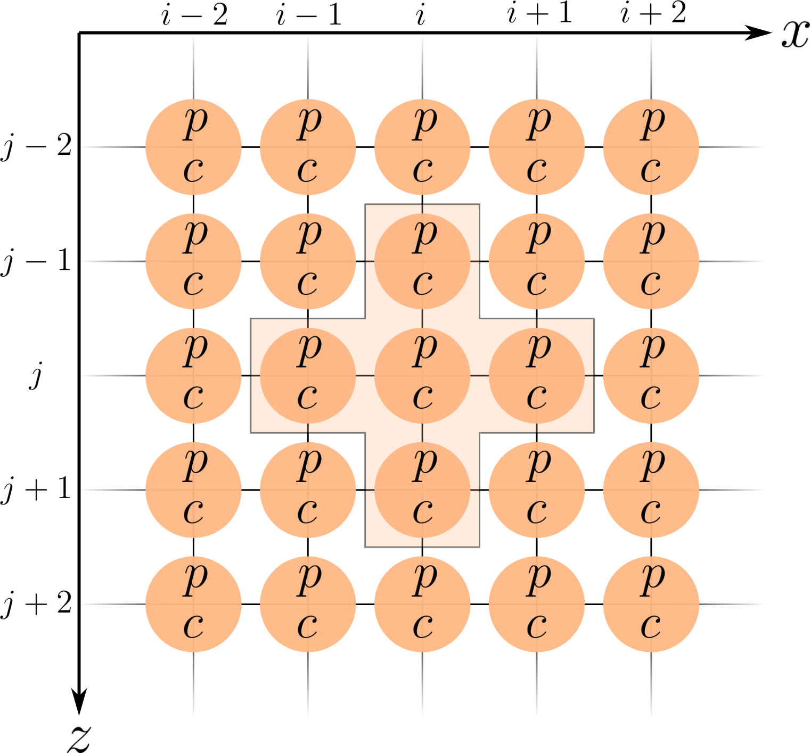
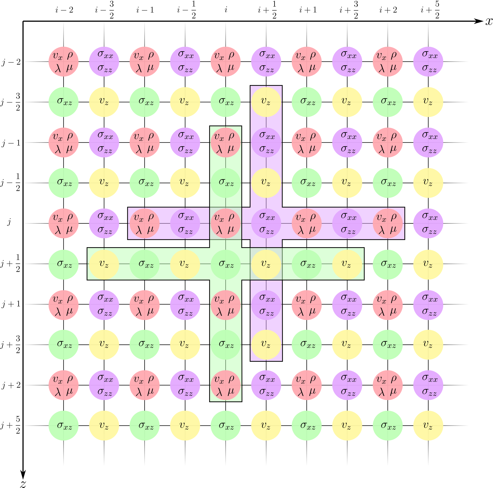

.. role:: raw-math(raw)
    :format: latex html
.. _seismicwaves2d_guide:

*******************************************************
Seismic wave propagation -- using ``seismicwaves2d``
*******************************************************

A general form of the elastic wave equation can be derived from the equation of motion and includes momentum and constitutive relationships

.. math::

   \begin{eqnarray}
      \rho\frac{\partial^2 u_i}{\partial t^2}&=\frac{\partial(\sigma_{ij}+M_{ij})}{\partial x_i}+f_i, \\
      \sigma_{ij}&=\lambda\epsilon_{kk}\delta_{ij}+2\mu\epsilon_{ij}, \\
      \epsilon_{kl}&=\frac{1}{2}\big(\frac{\partial u_l}{\partial x_k}+\frac{\partial u_k}{\partial x_l}\big),
   \end{eqnarray}
   
where :math:`u` is the displacement, :math:`\sigma` the stress tensor, :math:`M` the moment tensor :math:`\epsilon` the strain field, :math:`\lambda` and :math:`\mu` the Lame parameters, :math:`f` external forces, :math:`\delta` the Kronecker delta and :math:`i,j,k,l=1,2,3`.

From this relationship, some simplified expressions for specific cases can be derived and in the following we will see the derivation of the acoustic wave equation and the elastic wave equation.

=============================================
Acoustic wave equation in 2D
=============================================

	   
We model acoustic wave propagation through a medium by relating the time and space dependent pressure wavefield :math:`p(\mathbf{x},t)` to some external force :math:`f(\mathbf{x},t)` via the constant density acoustic wave equation. Therefore, we assume a constant density and a vanishing :math:`\mu` and obtain

.. math:: 

   -\frac{1}{c(\mathbf{x})^2} \frac{\partial^2 p(\mathbf{x},t)}{\partial t^2} + \nabla^2 p(\mathbf{x},t) = f(\mathbf{x},t). 

Here, the properties of the medium are parametrized in terms of velocity :math:`c(\mathbf{x},t)`. In 2D, :math:`\mathbf{x}=[x,z]^{\text{T}}` and the spatial derivatives are given by :math:`\nabla=\partial_x(\cdot)+\partial_z(\cdot)`. The acoustic wave equation explicitly shows the relationship between the velocity structure of the medium :math:`c(\mathbf{x},t)` and the pressure wavefield :math:`p(\mathbf{x},t)` generated by compressional waves. Thus, solving the acoustic wave equation involves determining the pressure field :math:`p(\mathbf{x}, t)`, which describes how the waves move through the medium over time.

Next, we can take the above `continuous` acoustic wave equation and discretize it using a second-order central difference scheme.  This yields the equation

.. math::

   f''(x) \approx \frac{f (x - \text{d}x) - 2 f(x) + f(x - \text{d}x)}{\text{d}x^2}

We can use this approximation of the second derivative to obtain a discrete version of the wave equation by replacing the second derivatives in both space :math:`\left(\nabla^2 p(\mathbf{x}, t)\right)` and time :math:`\left(\frac{\partial^2 p(\mathbf{x},t)}{\partial t^2}\right)`.  Here we will represent the indices in space using the subscripts :math:`i` and :math:`j` for the :math:`x`- and :math:`z`-indices, respectively.  Similarly, a superscript of :math:`n` will be used to denote the index in time.  Note that in the following discrete forms, we will omit the dependence of each variable (eg. :math:`p := p(\mathbf{x}, t)`) for the sake of brevity.  Thus, the second derivatives in space and time become

.. math::

   \begin{align}
		\nabla^2 p(\mathbf{x}, t) &\approx \frac{p_{i+1,\; j}^n - 2 p_{i,\; j}^n + p_{i-1,\; j}^n}{\Delta x^2} + \frac{p_{i,\; j+1}^n - 2 p_{i,\; j}^n + p_{i,\; j-1}^n}{\Delta y^2} \\
		\frac{\partial^2 p(\mathbf{x}, t)}{\partial t^2} &\approx \frac{p_{i,\; j}^{n + 1} - 2 p_{i,\; j}^n + p_{i,\; j}^{n-1}}{\Delta t^2}
	\end{align}

Substituting these central difference approximations into the continuous wave equation yields the discrete acoustic wave equation as given by

.. math::

   - \frac{1}{c_{i,\; j}^2} \frac{p_{i,\; j}^{n + 1} - 2 p_{i,\; j}^n + p_{i,\; j}^{n-1}}{\Delta t^2} + \left( \frac{p_{i+1,\; j}^n - 2 p_{i,\; j}^n + p_{i-1,\; j}^n}{\Delta x^2} + \frac{p_{i,\; j+1}^n - 2 p_{i,\; j}^n + p_{i,\; j-1}^n}{\Delta z^2} \right) = f_{i,\; j}^n.

and then rearranging for :math:`p_{i\; j}^{n+1}` to obtain

.. math::

   p_{i,\; j}^{n + 1} = \Delta t^2 c_{i,\; j}^2 \left( \frac{p_{i+1,\; j}^n - 2 p_{i,\; j}^n + p_{i-1,\; j}^n}{\Delta x^2} + \frac{p_{i,\; j+1}^n - 2 p_{i,\; j}^n + p_{i,\; j-1}^n}{\Delta z^2} \right) + 2 p_{i,\; j}^n - p_{i,\; j}^{n-1} + \Delta t^2 f_{i,\; j}^n
   
where :math:`\Delta x`, :math:`\Delta z`, and :math:`\Delta t` represent the discretization steps in space and time, respectively.

The intuitive meaning of this equation is that the pressure at each location in the finite difference grid is updated based on the adjacent nodes in both space (the :math:`x`- and :math:`z`-directions) and time.  This stencil (in space) can be visualized quite nicely as follows:

Thus, this allows us to get the pressure values for coordinates :math:`i` and :math:`j` for the next time step :math:`n+1` (ie. so that we can progress the simulation forward in time).

See the relevant Tutorial on acoustic waves for how to set up an acoustic simulation :ref:`Tutorial-05---Acoustic-Wave-Propagation`.

=============================================
Elastic wave equation in 2D
=============================================

The elastic wave equation describes the propagation of waves in an isotropic homogeneous elastic medium. Generally we are interested in obtaining the velocity vector :math:`\mathbf{v}`, consisting of the component of the velocity in each spatial direction. Noting that a component of the velocity vector is given by :math:`v_i=\frac{\partial u_i}{\partial t}` and inserting this into the elastic wave equation, one obtains the velocity-stress formulation for an isotropic medium as

.. math::

   \begin{align}
      \rho\frac{\partial v_i}{\partial t}&=\frac{\partial(\sigma_{ij}+M_{ij})}{\partial x_j}+f_i, \\
      \frac{\partial \sigma_{ij}}{\partial t}&=\lambda\frac{\partial \epsilon_{kk}}{\partial t}\delta_{ij}+2\mu\frac{\partial\epsilon_{ij}}{\partial t}, \\
      \frac{\partial \epsilon_{ij}}{\partial t}&=\frac{1}{2}\big(\frac{\partial v_j}{\partial x_i}+\frac{\partial v_i}{\partial x_j}\big).
   \end{align}

Note that reformulating the elastic wave equation in terms of velocity instead of displacement reduces the 2nd order derivative with respect to time to a 1st order derivative.

The discretization strategy used for the elastic wave equation is slightly different when compared to that used in the acoustic formulation.  In contrast to the acoustic formulation which used a finite difference stencil which is second-order accurate in both space and time, the stencil used in the elastic case is fourth-order accurate in space and second-order accurate in time.  

Furthermore, there are two different quantities which need to be sequentially updated in this setup: (1) velocities and (2) stresses.  Thus, a finite difference grid which is staggered in both space and time is used to achieve improved accuracy while incurring a relatively negligible increase in computational overhead.  This staggered grid configuration essentially allows for "half" steps to be taken in space in time (ie. allowing for time index :math:`n + \frac{1}{2}`, for example).  

First, the velocities can be represented using the first expression in the continuous elastic wave equation (ie. :math:`v_i`).  For the sake of readability, we will refer to intermediate quantities using :math:`D_\cdot (*)_{i, j}^n`.  The :math:`x`-component of the velocities :math:`v_x` can be updated using

.. math::

   \begin{align}
      D_x(\sigma_{xx})_{i, j}^n &= \frac{(\sigma_{xx})_{i - \frac{3}{2}, j}^n - 27 (\sigma_{xx})_{i - \frac{1}{2}, j}^n + 27 (\sigma_{xx})_{i + \frac{1}{2}, j}^n + (\sigma_{xx})_{i + \frac{3}{2}, j}^n}{24 \Delta x} \\
      D_z(\sigma_{xz})_{i, j}^n &= \frac{(\sigma_{xz})_{i, j - \frac{3}{2}}^n - 27 (\sigma_{xz})_{i, j - \frac{1}{2}}^n + 27 (\sigma_{xz})_{i, j + \frac{1}{2}}^n + (\sigma_{xz})_{i, j + \frac{3}{2}}^n}{24 \Delta z} \\
      (v_x)_{i, j}^{n + \frac{1}{2}} &= (v_x)_{i, j}^{n - \frac{1}{2}} + \frac{\Delta t}{\rho_{i, j}} \left( D_x (\sigma_{xx})_{i, j}^n + D_z(\sigma_{xz})_{i, j}^n \right)
   \end{align}

and the :math:`z`-component of the velocities :math:`v_z` can be updated using

.. math::

   \begin{align}
      D_x(\sigma_{xz})_{i + \frac{1}{2}, j + \frac{1}{2}}^n &= \frac{(\sigma_{xz})_{i - 1, j}^n - 27 (\sigma_{xz})_{i, j}^n + 27 (\sigma_{xz})_{i + 1, j}^n + (\sigma_{xz})_{i + 2, j}^n}{24 \Delta x} \\
      D_z(\sigma_{zz})_{i, j}^n &= \frac{(\sigma_{zz})_{i, j - 1}^n - 27 (\sigma_{zz})_{i, j}^n + 27 (\sigma_{zz})_{i, j + 1}^n + (\sigma_{zz})_{i, j + 2}^n}{24 \Delta z} \\
      (v_z)_{i + \frac{1}{2}, j + \frac{1}{2}}^{n + \frac{1}{2}} &= (v_z)_{i + \frac{1}{2}, j + \frac{1}{2}}^{n - \frac{1}{2}} + \frac{\Delta t}{\rho_{i + \frac{1}{2}, j + \frac{1}{2}}} \left( D_x (\sigma_{xz})_{i + \frac{1}{2}, j + \frac{1}{2}}^n + D_z(\sigma_{zz})_{i + \frac{1}{2}, j + \frac{1}{2}}^n \right).
   \end{align}

The spatial fourth-order accurate stencils for updating the velocities can be visualized as follows:

.. figure:: images/FD_stencil_elastic_velocity.png
   :align: center
   :width: 650px

A similar strategy can be used for updating the stresses :math:`\sigma` using

.. math::

   \begin{align}
      D_x(v_x)_{i + \frac{1}{2}, j}^{n + \frac{1}{2}} &= \left( \frac{(v_x)_{i - 1, j}^n - 27 (v_x)_{i, j}^n + 27 (v_x)_{i + 1, j}^n + (v_x)_{i + 2, j}^n}{24 \Delta x} \right) \\
      D_z(v_z)_{i + \frac{1}{2}, j}^{n + \frac{1}{2}} &= \left( \frac{(v_z)_{i, j - \frac{3}{2}}^n - 27 (v_z)_{i, j - \frac{1}{2}}^n + 27 (v_z)_{i, j + \frac{1}{2}}^n + (v_z)_{i, j + \frac{3}{2}}^n}{24 \Delta z} \right) \\
      (\sigma_{xx})_{i + \frac{1}{2}, j}^{n + 1} &= (\sigma_{xx})_{i + \frac{1}{2}, j}^n + \Delta t (\lambda_{i + \frac{1}{2}, j} + 2 \mu_{i + \frac{1}{2}, j}) D_x(v_x)_{i + \frac{1}{2}, j}^{n + \frac{1}{2}} + \Delta t \lambda_{i + \frac{1}{2}, j} D_z(v_z)_{i + \frac{1}{2}, j}^{n + \frac{1}{2}} \\
      (\sigma_{zz})_{i + \frac{1}{2}, j}^{n + 1} &= (\sigma_{zz})_{i + \frac{1}{2}, j}^n + \Delta t (\lambda_{i + \frac{1}{2}, j} + 2 \mu_{i + \frac{1}{2}, j}) D_z(v_z)_{i + \frac{1}{2}, j}^{n + \frac{1}{2}} + \Delta t \lambda_{i + \frac{1}{2}, j} D_x(v_x)_{i + \frac{1}{2}, j}^{n + \frac{1}{2}}
   \end{align}

and

.. math::

   \begin{align}
      D_z(v_x)_{i, j + \frac{1}{2}}^{n + \frac{1}{2}} &= \left( \frac{(v_x)_{i, j - 1}^n - 27 (v_x)_{i, j}^n + 27 (v_x)_{i, j + 1}^n + (v_x)_{i, j + 2}^n}{24 \Delta z} \right) \\
      D_x(v_z)_{i, j + \frac{1}{2}}^{n + \frac{1}{2}} &= \left( \frac{(v_z)_{i - \frac{3}{2}, j}^n - 27 (v_z)_{i - \frac{1}{2}, j}^n + 27 (v_z)_{i + \frac{1}{2}, j}^n + (v_z)_{i + \frac{3}{2}, j}^n}{24 \Delta x} \right) \\
      (\sigma_{xz})_{i, j + \frac{1}{2}}^{n + 1} &= (\sigma_{xz})_{i, j + \frac{1}{2}}^n + \Delta t \mu_{i, j + \frac{1}{2}} \left( D_z(v_x)_{i, j + \frac{1}{2}}^{n + \frac{1}{2}} + D_x (v_z)_{i, j + \frac{1}{2}}^{n + \frac{1}{2}} \right).
   \end{align}

Similar to the stencil for the velocity updates, the fourth-order accurate stencils for the stress updates can be visualized as follows:

Note that the source :math:`f` is injected differently depending on whether a moment tensor source or a force source is considered.  Force sources are added to the updated velocity values whereas the components of the moment tensor source are added to the updated stresses.

See the relevant Tutorial on elastic waves for how to set up an elastic simulation.

=============================================
Boundary conditions
=============================================

There are two primary types of boundary conditions which are supported for both the acoustic and elastic formulations:

1. Free-surface boundary conditions
2. Perfectly matched (PML) layer boundary conditions

