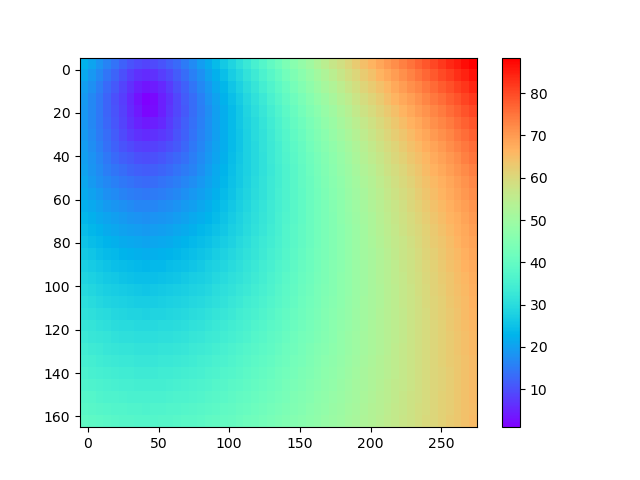

.. role:: raw-math(raw)
    :format: latex html
.. _ttimerays_guide:

*******************************************
Traveltimes and rays -- using ``ttimerays``
*******************************************
Computing travel times and rays through a velocity model is comprised of two main steps:

1. Discretizing the velocity model on a numerical grid.
2. Formulating the forward problem of wave front propagation and finding a solution for the discretized model numerically.

PestoSeis offers functions performing both steps and provides additional visualization tools. 

====================================
Setup of grid parameters and models
====================================

In order to compute traveltimes and rays, a 2D grid must be generated to discretize the computational domain. The grid is set up by defining its dimensions in terms of number of cells in the two ``x`` and ``y`` directions and cell size. Within each cell, the velocity is constant. 
See :func:`pestoseis.ttimerays.setupgrid` for how to create the *dictionary* holding the grid parameters needed for subsequent computations.

Example::
  
  import pestoseis.ttimerays as tr
 
  # create a 2D grid with 50x30 cells
  nx,ny = 50,30
  # size of the cells
  dh = 5.0
  # origin of grid axes
  xinit,yinit = 0.0,0.0

  # create the dictionary containing the grid parameters
  gridpar = tr.setupgrid(nx, ny, dh, xinit, yinit)

==================
 Visualization
==================

Some functions for different kinds of plots are provided (click on the function
name to get the docstring):

* plot the grid: :func:`pestoseis.ttimerays.plotgrid`
* plot the traveltime array: :func:`pestoseis.ttimerays.plotttimemod`
* plot the velocity model: :func:`pestoseis.ttimerays.plotvelmod`
* plot (previously traced) rays: :func:`pestoseis.ttimerays.plotrays`

Example of plotting the grid::

  import pestoseis.ttimerays as tr
  # import the plotting library
  import matplotlib.pyplot as pl

  # create a 2D grid with 50x30 cells
  nx,ny = 50,30
  # size of the cells
  dh = 5.5
  # origin of grid axes
  xinit,yinit = 0.0,0.0

  # create the dictionary containing the grid parameters
  gridpar = tr.setupgrid(nx, ny, dh, xinit, yinit)
  
  # plot the grid
  pl.figure()
  tr.plotgrid(gridpar)
  pl.show()

which produces the following image

.. figure::  images/gridpl.png
   :align:   center
   :width: 400px

Other examples are provided in the following sections.

==========================
Computation of traveltimes
==========================

One possible way to model wave propagation in a medium is to assume that waves can be approximated by rays of infinite frequency along the path between a source and a receiver. If we consider a specific ray :math:`i` along a path :math:`\Gamma_i`, then we can obtain the traveltime :math:`t_i` belonging to that ray by solving the line integral

.. math::

   t_i=\int_{\Gamma_i(s(\mathbf{x}))}s(\mathbf{x}(l))dl,
    
where :math:`\mathbf{x}=[x,y]^{\text{T}}` in :math:`\mathbb{R}^2` and :math:`s=s(\mathbf{x})` is the slowness map of the medium and is related to velocity by :math:`s(\mathbf{x})=\frac{1}{c(\mathbf{x})}`, :math:`dl` is an infinitesimal line segment on the path and :math:`\mathbf{x(}l)` is the parametrization of the spatial variable in terms of :math:`l`. To solve this line integral is difficult since it is non-linear in the ray path, which means that the path taken by the ray itself depends on the velocity structure of the medium, which is unknown in realistic experiments. One way to circumvent the explicit need to find ray paths to compute travel times is to decribe the propagation of wavefronts through a medium in 2D with the eikonal equation

.. math::
   
   \left|\nabla t(\mathbf{x})\right|^2=\bigg(\frac{\partial t(\mathbf{x})}{\partial x}\bigg)^2+\bigg(\frac{\partial t(\mathbf{x})}{\partial y}\bigg)^2=s(\mathbf{x})^2,

where :math:`t(\mathbf{x})` is the traveltime of the wavefront. Note that due to the absolute value, this equation is also non-linear but there exist efficient methods that allow us to solve this partial differential equation equation numerically on a grid. PestoSeis makes use of the Fast Marching Method (FMM), which obtains the traveltime from a source point in a grid to all the other grid points for a given slowness field. In PestoSeis, traveltime calculation given a velocity model and one or more sources and related receivers can be performed using the function :func:`pestoseis.ttimerays.traveltime`. By default the function returns both the traveltimes at the receivers and also the entire 2D traveltime array(s) for subsequent ray tracing.

Example::

  # import the traveltime-rays sub-module
  import pestoseis.ttimerays as tr
  import numpy as np
  # import the plotting library
  import matplotlib.pyplot as pl

  # create a 2D grid with 50x30 cells
  nx,ny = 50,30
  # size of the cells
  dh = 5.5
  # origin of grid axes
  xinit,yinit = 0.0,0.0

  # create the dictionary containing the grid parameters
  gridpar = tr.setupgrid(nx, ny, dh, xinit, yinit)

  # define a velocity model
  velmod = 3.0*np.ones((nx,ny))
  # define the position of sources and receivers, e.g.,
  recs = np.array([[30.4, 22.3],
                   [10.1, 20.0],
		   [12.4,  9.5]])
  srcs = np.array([[ 3.4,  2.3],
                   [42.4, 15.5]])
  ## calculate all traveltimes
  ttpick,ttime = tr.traveltime(velmod,gridpar,srcs,recs)

``ttpick`` contains an array whose elements are the traveltimes at receivers for each source. In this example we have two sources, hence ``ttpick`` has two elements: each of them contains an array with three elements representing the traveltime for each receiver with respect to the source. Similarly, ``ttime`` is an array of arrays. In this example we have three sources, so ttime contains three arrays where each of them holds the traveltimes at all grid nodes (for the entire model) for one of the sources.

To plot the velocity model one can use the function :func:`pestoseis.ttimerays.plotvelmod`::

  pl.figure()
  tr.plotvelmod(gridpar,velmod)
  pl.show()

.. figure::  images/velmod1.png
   :align:   center
   :width: 400px 

To plot the resulting traveltimes for a selected source (source #1 in this example), one can use the function :func:`pestoseis.ttimerays.plotttimemod`::

  pl.figure()
  tr.plotttimemod(gridpar,ttime[1])
  pl.show()

==================
Rays
==================

-------------------------------------------
Trace rays in a 2D heterogeneous model
-------------------------------------------

Even though solving the eikonal equation as previously describes results in traveltime information on all grid points without the need to explicitly calculate the ray paths through the medium, there are still stituations where we are interested in obtaining the ray paths between the sources and the receivers. For instance, to set up a tomographic problem, we need to know the length of a ray within each grid cell to set up a sparse `tomography matrix`. We can make use of the previously computed traveltimes to trace (approximately) the rays using the function :func:`pestoseis.ttimerays.traceallrays`. This function traces the rays starting from a receiver position by following the gradient of the traveltimes :math:`\nabla t(\mathbf{x})` back through the computed traveltime field to the source. Hence the computed ray path consists of piecewise linear segments (within each grid cell).  

Example::

  # import the traveltime-rays sub-module
  import pestoseis.ttimerays as tr
  import numpy as np
  # import the plotting library
  import matplotlib.pyplot as pl

  # create a 2D grid with 50x30 cells
  nx,ny = 50,30
  # size of the cells
  dh = 5.5
  # origin of grid axes
  xinit,yinit = 0.0,0.0

  # create the dictionary containing the grid parameters
  gridpar = tr.setupgrid(nx, ny, dh, xinit, yinit)

  # define a velocity model
  velmod = 3.0*np.ones((nx,ny))
  # define the position of sources and receivers, e.g.,
  recs = np.array([[30.4, 22.3],
                   [10.1,  20.0],
		   [12.4,  9.5]])
  srcs = np.array([[ 3.4,  2.3],
                   [42.4, 15.5]])
  ## calculate all traveltimes
  ttpick,ttime = tr.traveltime(velmod,gridpar,srcs,recs)

  
  ## now trace rays (ttime contains a set of 2D traveltime arrays)
  rays = tr.traceallrays(gridpar,srcs,recs,ttime)

The computed rays take ray bending in a heterogeneous media into account (in the limit of the grid cell size). 
The output ``rays`` is an array of objects where the number of objects corresponds to the number of receivers. Each object is in turn an array with as many elements as the number of sources. Each of this elements contains all the information relative to a single ray: the coordinates of the points of the ray, the indices of which cells it crosses and the length of the segments in such cells.

The function :func:`pestoseis.plotrays` ` is used to visualize the results:::

  pl.figure()
  tr.plotrays(srcs,recs,rays)
  pl.show()

.. figure::  images/rays1.png
   :align:   center
   :width: 400px 

-------------------------------------------
Trace *straight* rays
-------------------------------------------
A very common simplification to the non-linear formulation of the travel time inegral is to invoke the *straight-ray approximation* by linearizing the integral with respect to the ray path, fixing the geometry of a ray to a straight line between a source and a receiver. This simplifies the integral formulation to

.. math::

   t_i=\int_{\Gamma_i}s(\mathbf{x}(l))dl,

with :math:`t_i` being the traveltime of the ith ray. On the grid, the discrete formulation of this integral is given by the sum 

.. math::

   t_i=\sum_{j=1}^nl_{ij}s_j,

where :math:`l_{ij}` is the segment of ray :math:`i` in cell :math:`j` and :math:`n` is the total number of cells. To trace straight rays, use the function :func:`pestoseis.ttimerays.traceall_straight_rays`.

Example::

  # import the traveltime-rays sub-module
  import pestoseis.ttimerays as tr
  import numpy as np
  # import the plotting library
  import matplotlib.pyplot as pl

  # create a 2D grid with 50x30 cells
  nx,ny = 50,30
  # size of the cells
  dh = 5.5
  # origin of grid axes
  xinit,yinit = 0.0,0.0

  # create the dictionary containing the grid parameters
  gridpar = tr.setupgrid(nx, ny, dh, xinit, yinit)

  # define a velocity model
  velmod = 3.0*np.ones((nx,ny))
  # define the position of sources and receivers, e.g.,
  recs = np.array([[30.4, 22.3],
                   [10.1,  20.0],
		   [12.4,  9.5]])
  srcs = np.array([[ 3.4,  2.3],
                   [42.4, 15.5]])
		   
  ## now trace straight rays
  rays = tr.traceall_straight_rays(gridpar,srcs,recs)

  
The output ``rays`` has the same structure than the output of :func:`pestoseis.ttimerays.traceallrays`: see above for a description. 
The function :func:`pestoseis.plotrays` ` is used to visualize the results:::

  pl.figure()
  tr.plotrays(srcs,recs,rays)
  pl.show()

  

	   
-----------------------------------------------
Trace rays in a *horizontally layered* medium
-----------------------------------------------

As a third option to trace rays, Pestoseis offers the possibility to compute ray paths, traveltime and the distance covered in  a horizonally layered medium. Provided the depths of the layers and their velocity, the function :func:`pestoseis.ttimerays.tracerayhorlay` applies Snell's law :math:`\text{sin}\theta_1s_1=\text{sin}\theta_2s_2`, with :math:`\theta_1` being the angle of incidence in layer 1 with slowness :math:`s_1` and :math:`\theta_2` being the angle of transmission in layer 2 with slowness :math:`s_2`, repeatedly for each interface the ray encounters. The geometrical setup is the following:

.. figure::  images/geom-rays-horlayers.png
   :align:   center
   :width: 300px

As an input, the angle *theta* being the take off angle, measured anti-clockwise from the vertical as well as the number of horizontal layers, the depth location of the indicidual interfaces and the velocity within each layer are required.

Example::

  import pestoseis.ttimerays as tr
  import numpy as np
  # number of layers
  Nlay = 120
  # depth of layers -- includes both top and bottom (Nlay+1)
  laydepth = np.linspace(0.0,2000.0,Nlay+1)[1:]
  # velocity
  vel = np.linspace(2000.0,3000.0,Nlay)
  # origin of ray
  xystart = np.array([0.0, 0.0])
  # take off angle
  takeoffangle = 45.0

  # trace a single ray
  raypath,tt,dist = tr.tracerayhorlay(laydepth, vel, xystart, takeoffangle)

To show the ray path a simple plot can be created:::

  pl.figure()
  pl.plot(raypath[:,0],raypath[:,1],'.-')
  pl.gca().invert_yaxis()
  pl.show()

.. figure::  images/horrays1.png
   :align:   center
   :width: 500px

-----------------
Ray tomography
-----------------

The previously computed traveltimes and rays can be used to set up a tomographic problem. PestoSeis provides the function :func:`pestoseis.ttimerays.lininv` to perform a simple linear inversion under Gaussian assumptions (least squares approach). In order to run the inversion the `tomography matrix` (containing the length of the rays in each cell), the prior mean model and covariances for observed data and model parameters are needed. If we imagine to perform an experiment using a grid of :math:`n` cells and a total number of :math:`m` source-receiver pairs, resulting in :math:`m` rays, then we can leverage the benefit of the linear forward problem by building a linear system of equations

.. math::

   \begin{eqnarray}
      \begin{gathered}
         t_1=l_{11}s_1+\dots+l_{1j}s_{j}+\dots+l_{1n}s_n \\
         \vdots \\
         t_i=l_{i1}s_1+\dots+l_{ij}s_{j}+\dots+l_{in}s_n \\
         \vdots \\
         t_m=l_{m1}s_1+\dots+l_{mj}s_{j}+\dots+l_{mn}s_n.
      \end{gathered}
   \end{eqnarray}

This can be condensed to matrix vector notation by introducing the forward modelling matrix :math:`\mathbf{G}` of dimensions :math:`m\times n` that collects all line segments :math:`l_{ij}` for every source-receiver pair as

.. math::

      \mathbf{d}_{\text{obs}}=\mathbf{G}\mathbf{m},

where :math:`\mathbf{d}_{\text{obs}}` is the vector of observed traveltimes from every source to every receiver and :math:`\mathbf{m}` is the model vector containing the slowness map that is supposed to be inferred in the inversion.

After calculating the rays using :func:`pestoseis.ttimerays.traceallrays` the tomography matrix :math:`\mathbf{G}` can be built subsequently using :func:`pestoseis.ttimerays.buildtomomat`. This kind of inversion is quite primitive and therefore often unstable. The model that fits the data best is the one that minimizes the *least-squares misfit functional*

.. math::

   S( \mathbf{m}) = \frac{1}{2} ( \mathbf{G} \mathbf{m} - \mathbf{d}_{\sf{obs}} )^{\sf{T}}
   \mathbf{C}^{-1}_{\rm{D}} ( \mathbf{G} \mathbf{m} - \mathbf{d}_{\sf{obs}} )
   + \frac{1}{2} ( \mathbf{m} - \mathbf{m}_{\sf{prior}} )^{\sf{T}} \mathbf{C}^{-1}_{\rm{M}}
     ( \mathbf{m} - \mathbf{m}_{\sf{prior}} ).

The results are the posterior mean model and covariance matrix (we are under Gaussian assumptions).

The posterior covariance matrix is given by

.. math::

   \mathbf{\widetilde{C}}_{\rm{M}} =  \left( \mathbf{G}^{\sf{T}} \,
   \mathbf{C}^{-1}_{\rm{D}} \, \mathbf{G} + \mathbf{C}^{-1}_{\rm{M}} \right)^{-1}

and the center of posterior Gaussian (the mean model) is

.. math::

   \mathbf{\widetilde{m}}
   = \mathbf{m}_{\rm{prior}}+ \mathbf{\widetilde{C}}_{\rm{M}} \, \mathbf{G}^{\sf{T}} \, \mathbf{C}^{-1}_{\rm{D}} \left(\mathbf{d}_{\rm{obs}} - \mathbf{G} \mathbf{m}_{\rm{prior}} \right) .

Example::

  [...]

  # trace rays
  rays = tr.traceallrays(gridpar,sources,receivers,bkgttimegrd)
  # build the tomography matrix
  tomomat,residualsvector = tr.buildtomomat(gridpar, rays, residuals)

  # Perform the actual inversion using a "least-squares" approach
  postm,postC_m = tr.lininv(tomomat,cov_m,cov_d,mprior,residualsvector)

