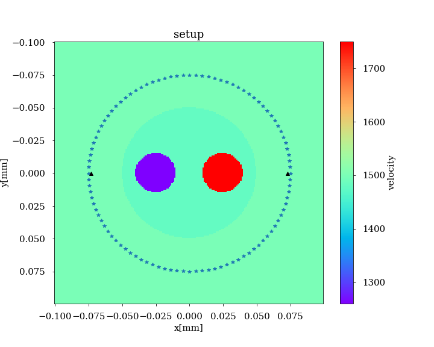
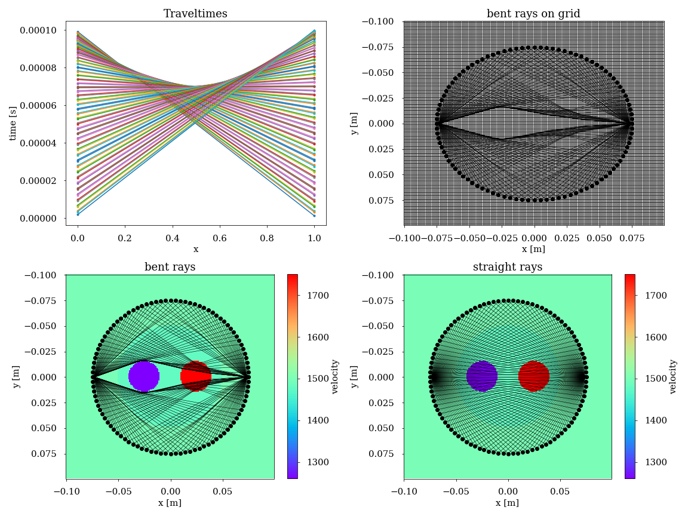

Tutorial 04 -  Medical Ultrasound: Calculate travel times using the USCT setup
==============================================================================
This exercise illustrate that the methods used in seismics are ubiquitous in many other research areas. Therefore, understanding the methods asslows one to bridge the gap between different fields of research.

.. code-block:: python

   import numpy as np
   import matplotlib.pyplot as plt
   import sys
   import h5py
   import pestoseis.ttimerays as tr
   import matplotlib.gridspec as gridspec
   
   # make some nice plots
   plt.rcParams["font.family"] = "serif"
   plt.rcParams.update({"font.size": 15})
   plt.rcParams["xtick.major.pad"] = "12"
   plt.rcParams["ytick.major.pad"] = "12"

1. Problem Setup
****************
In this exercise, the input velocity model describes the speed-of-sound distribution within a breast phantom that mimicks a cross-sectional slice through a breast. The phantom shapes are kept desiberately simple in order to be able to evaluate the accuracy of the calculated travel times.

First, we start off by importing our data and gridding the domain:

.. code-block:: python

   filename = f'inputdata/breast_model.h5'
   print(filename)

.. code-block:: python

   with h5py.File(filename,"r") as f:
       velmod = np.array(f["true_model"]["velomod"])

Let's make a circular source-receiver array. In USCT we have a lot more freedom compared to the seismic application when it comes to the design of our experiement. In particular, we have the possibility to illuminate the unknown object from all angles. Additionaly, it is common to have transducer elements that can be used in transmit as well as in receive mode. Therefore the source and receivers are usually at the same location around the breast phantom. For this experiment however, we move the receiver positions inside the source array, since PestoSeis cannot candle coniciding source-receiver positions. 

.. code-block:: python

   nrec = 100 # number of receivers
   nsrc = 100 # number of sources
   rsrc = 0.075 # Radius of source array [m]
   rrec = 0.073 # Radius of receiver array [m]
   phi = np.arange(0,2 * np.pi,2 * np.pi / float(nsrc)) # angle 
   x_src = rsrc * np.cos(phi) 
   y_src = rsrc * np.sin(phi)
   x_rec = rrec * np.cos(phi) 
   y_rec = rrec * np.sin(phi)

.. code-block:: python

   sources = np.array([x_src, y_src])
   receivers = np.vstack((np.array([(x_rec[0], y_rec[0])]), np.array([(x_rec[50], y_rec[50])])))

2. setup grid object
********************

.. code-block:: python

   nx = 200
   ny = 200
   dh = 0.001
   xinit = -0.1
   yinit = -0.1
   gridpar = tr.setupgrid(nx,ny,dh,xinit,yinit)

3.  Compute the Traveltimes
***************************
Similar to in the previous exercise, we want to compute the traveltimes for the different source-receiver positions. Let's first take a look at our setup!

.. code-block:: python

   plt.figure(figsize=(10,8))
   tr.plotvelmod(gridpar,velmod)
   plt.plot(sources[0,:],sources[1,:],"*")
   plt.plot(receivers[0,0],receivers[0,1],"^k")
   plt.plot(receivers[1,0],receivers[1,1],"^k")

We first compute the travel times to all the receivers by solving the Eikonal euqtaion:

.. math::

   \lvert|\nabla t(\mathbf{x})\rvert|^2=\big(\frac{\partial t(\mathbf{x})}{\partial x_1}\big)^2+\big(\frac{\partial t(\mathbf{x})}{\partial x_2}\big)^2=\frac{1}{c(\mathbf{x})^2}\;\;\;\text{with} \;\mathbf{x}\in\mathbb{R}^2, \mathbf{x}=[x_1,x_2]^{\text{T}}.

Note that this equation is non-linear due to the explicit dependency of the path on the velocity model. We therefore need to include the velocity model in the travel time calculation as seen below. 

.. code-block:: python

   ttpick,ttime = tr.traveltime(velmod, gridpar, sources.T, receivers)

4. Trace the Rays
*****************
Now that we have the traveltimes we can trace the rays to see the ray paths throughout the domain. In PestoSeis, we have the possibility to trace bent rays, as well as straight rays. Bent rays obay Fermat's principle stating that the travel time along a path is minimized. To compute the bent ray paths from the previously obtained travel times, a ray is traced back from a receiver to each source location by stepping in the negative direction of the spatial gradient of the travel times. Once the backtraced ray hits a cell boundary, the spatial travel time gradient is again evaluated on the entire grid and the ray is advanced until it hits another boundary. This is executed until the ray hits the source position.

.. code-block:: python

   rays = tr.traceallrays(gridpar, sources.T, receivers, ttime)

.. code-block:: python

   straightrays = tr.traceall_straight_rays(gridpar, sources.T, receivers)

5. Plot the Results
*******************
We can not plot the following results:
* The traveltimes for each receiver receiver position
* The ray paths travelled through the domain

.. code-block:: python

   fig = plt.figure(figsize=(16,12))
   gs = gridspec.GridSpec(2, 2)
   plt.subplot(gs[0, 0]) 
   plt.title('Traveltimes')
   for i in range(ttpick.size):
       plt.plot(ttpick[i][:],'.-',label='src {}'.format(i))
   plt.xlabel("x")
   plt.ylabel("time [s]")

   plt.subplot(gs[0,1]) 
   tr.plotrays(sources.T,receivers,rays)
   tr.plotgrid(gridpar)
   plt.title("bent rays on grid")
   plt.xlabel("x [m]")
   plt.ylabel("y [m]")

   plt.subplot(gs[1,0]) 
   tr.plotvelmod(gridpar,velmod)
   tr.plotrays(sources.T,receivers,rays)
   plt.title("bent rays")
   plt.xlabel("x [m]")
   plt.ylabel("y [m]")

   plt.subplot(gs[1,1]) 
   tr.plotvelmod(gridpar,velmod)
   tr.plotrays(sources.T,receivers,straightrays)
   plt.title("straight rays")
   plt.xlabel("x [m]")
   plt.ylabel("y [m]")
   fig.tight_layout(pad=1.0)
   plt.show() 

